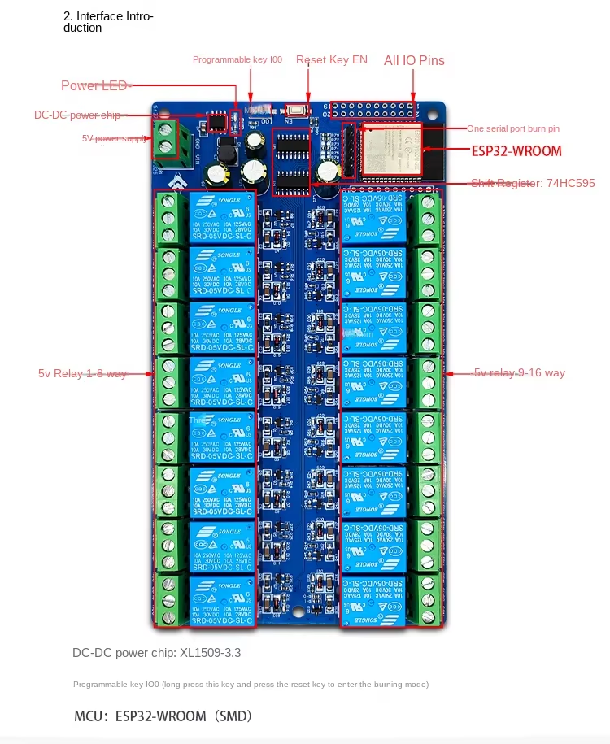
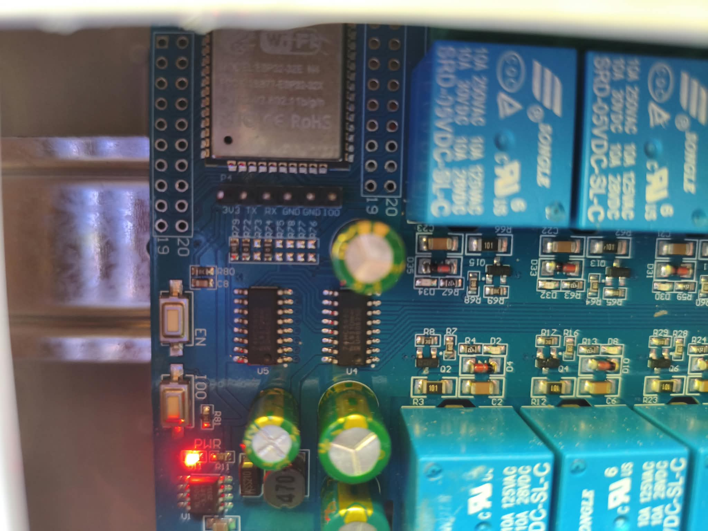
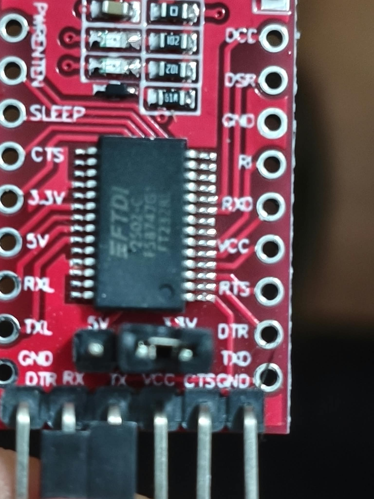

# Opensprinkler for ESP32 and 74HC595 shift register

Opensprinkler for ESP32 adapted to 74HC595 shift register. This is normally a board like this:



This firmware targets boards such as the **LCTech / ChinaLCTech ESP32 16-channel relay module** (two cascaded 74HC595 shift registers). The board exposes a dedicated UART programming header and `IO0` / `EN` buttons for serial flashing.

## Hardware setup

### FT232RL USB-to-serial adapter

Use a USB-to-TTL adapter (FT232RL or equivalent). The ESP32 UART pins (`GPIO1` / `GPIO3`) use **3.3 V logic** — do not drive them with 5 V.

Connect the adapter to the board’s **serial programming header** (UART0: `TX` = GPIO1, `RX` = GPIO3). Cross **TX** and **RX** (adapter TX goes to board RX, adapter RX goes to board TX).




#### Wiring with USB power (bench testing)

Use this when the board is **not** connected to a wall power supply. The FT232RL powers the ESP32 over USB:

| FT232RL | ESP32 board |
|---------|-------------|
| **GND** | **GND** |
| **VCC / 5V** | **VIN / 5V** |
| **TX** | **RX** (GPIO3) |
| **RX** | **TX** (GPIO1) |

If uploads fail or the board resets, use the board’s **5 V DC input** instead and keep only **GND**, **TX**, and **RX** connected from the FT232RL.

#### Wiring with external power (wall-mounted)

Use this when the board is **already installed** and powered from a wall supply. **Do not** connect FT232RL `VCC / 5V` to the ESP32 — the board is powered externally. A **common ground** between the FT232RL and the ESP32 is required:

| FT232RL | ESP32 board |
|---------|-------------|
| **GND** | **GND** *(required — common ground)* |
| **TX** | **RX** (GPIO3) |
| **RX** | **TX** (GPIO1) |
| **VCC / 5V** | *(leave disconnected)* |

Relay coils still need the board’s **5 V** supply when testing outputs.

### Enter download (bootloader) mode

The board does not auto-reset into bootloader mode over serial.

#### USB-powered board

1. Connect the FT232RL as above and plug it into the PC.
2. Connect **GPIO0** to **GND** (jumper wire, or hold the **IO0** button if your board has one).
3. Press **EN / RST** once, or power-cycle the board.
4. Start the firmware upload in PlatformIO immediately.

#### Wall-powered board (external supply)

Follow these steps in order:

1. **Enter flash mode:** Connect **GPIO0** to **GND** with a jumper wire and leave it connected.
2. **Power on the board:** Turn on the external power supply feeding the ESP32.
3. **Force bootloader boot:** Press and release **EN / RST** once. The microcontroller reboots with GPIO0 held low and waits for a firmware upload.
4. **Connect USB:** Plug the FT232RL into your computer.
5. **Start the upload:** In VS Code, click the **Upload** (→) button on the PlatformIO toolbar.
6. **Wait for completion:** The terminal shows erase and write progress from 0% to 100% (`Writing at 0x... 100%`).
7. **Return to normal mode:** As soon as the upload finishes, remove the **GPIO0** to **GND** jumper.
8. **Boot the firmware:** Press and release **EN / RST** once more (or power-cycle the external supply).

## Flashing the firmware

### Prerequisites

- [VS Code](https://code.visualstudio.com/) with the [PlatformIO](https://platformio.org/) extension, **or** the [PlatformIO Core CLI](https://docs.platformio.org/en/latest/core/installation.html) (`pio`).
- USB drivers for the FT232RL (usually built in on Linux; on Windows/macOS install FTDI drivers if needed).
- Review **`esp32.h`** and adjust options for your hardware (flash size, LCD type, sensors, etc.). By default **`ESP32_FLASH_4MB`** is enabled, matching the 4 MB flash on these boards.

### Build and upload (VS Code)

1. Clone this repository and open the project folder in VS Code.
2. Wait for PlatformIO to install the ESP32 platform and libraries.
3. Connect the FT232RL and put the board in download mode (see above).
4. Select the **`esp32_sprinkler`** environment (default in `platformio.ini`).
5. Click **PlatformIO: Upload** (arrow icon on the bottom toolbar), or run **PlatformIO: Upload and Monitor**.

### Build and upload (command line)

```bash
# Install PlatformIO Core if needed: https://docs.platformio.org/en/latest/core/installation.html

# Put the board in download mode, then:
pio run -e esp32_sprinkler -t upload

# Optional: specify the serial port (Linux example)
pio run -e esp32_sprinkler -t upload --upload-port /dev/ttyUSB0

# Serial monitor (115200 baud)
pio device monitor -e esp32_sprinkler
```

On Windows, use a port such as `COM3`; on macOS, `/dev/cu.usbserial-*`.

### What happens during upload

- The **`esp32_sprinkler`** environment builds the OpenSprinkler firmware for ESP32 with LittleFS.
- **`esp32_partition_setup.py`** picks the partition table and flash size from `esp32.h`.
- **`merge_firmware.py`** merges bootloader, partition table, and application into a single image and flashes it at address `0x0`.

If upload fails with “Failed to connect” or “Timed out”, check TX/RX wiring, common **GND**, that the board is powered (USB or external supply), and that **GPIO0** is connected to **GND** during reset.

### After flashing

1. Disconnect **GPIO0** from **GND**, then press **EN / RST** or power-cycle the board.
2. Later firmware updates can also be done **over the air (OTA)** from the web interface once the device is on your network.

### First-time WiFi setup

After the first successful flash, the board broadcasts a WiFi access point named **`OSXXXX`** (the last digits match your device ID).

1. Connect to **`OSXXXX`** from any phone, tablet, or computer.
2. A WiFi configuration page opens automatically. If it does not, browse to `http://192.168.4.1`.
3. Select your home WiFi **SSID**, enter the **password**, and optionally set **BSSID** and **channel**.
4. Submit the form and wait for the board to connect to your network.
5. Press **EN / RST** once. Your OpenSprinkler is ready to use.

You can also use the serial monitor at **115200** baud for debug output during setup.

## Configuration

Pin mappings for the 74HC595 relay board (shift register data/clock/latch/OE, 16 stations) are defined in **`esp32.h`**. See **`README.txt`** for additional hardware notes and limitations.

### View Full Documentation

[](https://opensprinkler.github.io/OpenSprinkler-Firmware/)
